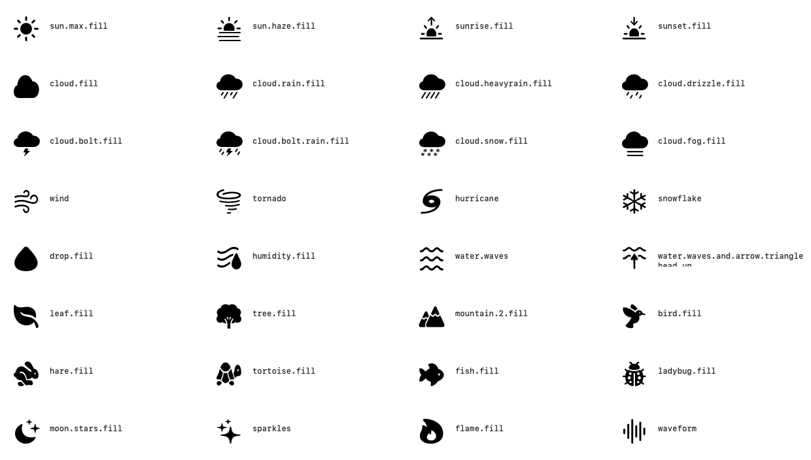
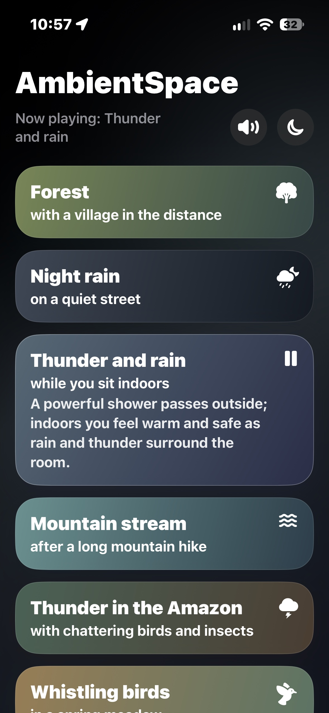
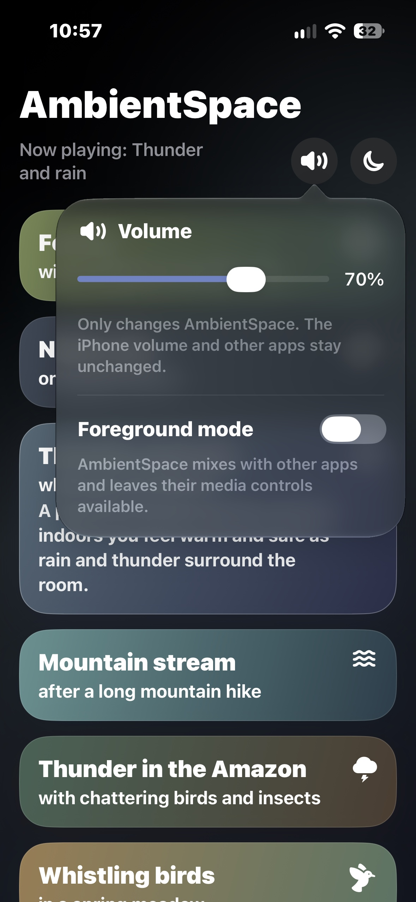
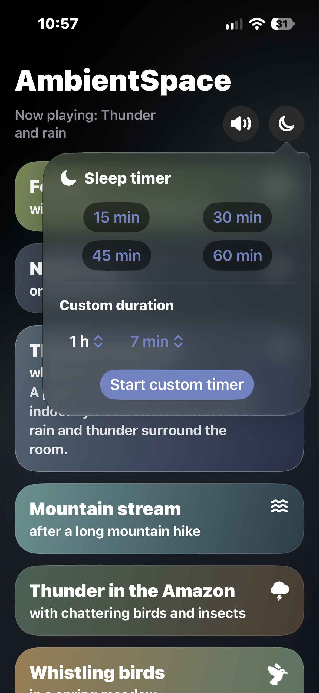
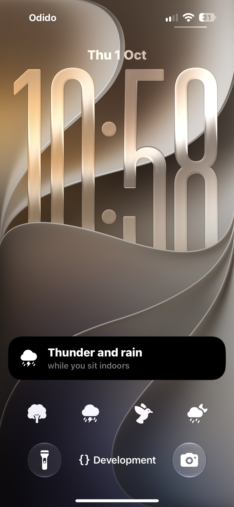
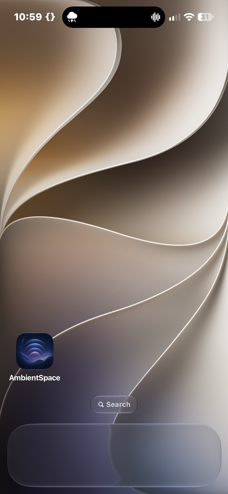

<h1 align="center">AmbientSpace</h1>

<p align="center">
  
</p>

<p align="center">Ambient recordings, at your own volume.</p>

<p align="center">
  iPhone · iOS 17+ · SwiftUI · <a href="LICENSE">MIT licensed</a> · Preview
</p>

<p align="center">
  <a href="#getting-started">Getting started</a> ·
  <a href="audio-files/README.md">Add sounds</a> ·
  <a href="#install-on-an-iphone">Install on iPhone</a> ·
  <a href="CONTRIBUTING.md">Contribute</a>
</p>

AmbientSpace is a small, native iPhone app for looping ambient recordings. Mix a quiet background with music from another app, or give AmbientSpace its own Lock Screen controls. It uses SwiftUI and Apple's audio frameworks, without a backend, accounts, analytics, streaming, or third-party packages.

**Preview status:** this is a buildable source project, not a finished App Store release. Bring your own recordings; no audio library is included. Known limitations and dated test results are listed below.

## Features

- **Independent volume.** Turn AmbientSpace down without changing another app's volume. Hardware volume buttons still control the phone's system volume.
- **Infinite looping and transitions.** Every recording repeats indefinitely by default, with a six-second crossfade into the next repetition and when switching recordings.
- **System playback.** Background mode mixes with other apps. Foreground mode provides artwork and play, pause, previous, and next controls on the Lock Screen and in Control Center. When metadata contains an SF Symbol, that symbol is used as the system artwork.
- **System actions.** “Play a random sound” and “Play sound” are available through App Shortcuts. On iOS 18 or later, a reusable sound control can be added multiple times to Control Center, the Lock Screen, or the Action button. Each copy is configured with a sound and displays that sound's SF Symbol.
- **Interactive widgets.** A configurable Small widget offers up to nine positions for random playback, global play/pause, or chosen sounds. Circular and rectangular Lock Screen widgets show and control one chosen sound. Widget actions are available on iOS 17 or later.
- **Live Activity.** While audio is playing, the current sound and its symbol appear on the Lock Screen and supported Dynamic Island devices. Tapping it opens AmbientSpace. Pausing or stopping ends the Live Activity.
- **Sleep timer.** Choose 15, 30, 45, or 60 minutes, or a custom duration from one minute to twelve hours. Audio fades during the final fifteen seconds.
- **A simple library.** Color gradients come from recording metadata. Tap a title to reveal its description; use the separate button to play or pause.
- **Seven languages.** Recording metadata and the interface support English, Dutch, French, German, Spanish, Italian, and Brazilian Portuguese and follow the phone's language preferences. There is no in-app language setting.

The app starts paused, in background mode, at 100% app volume. Playback state, app volume, mode, and timer are not saved between full launches.

If a sound's `sfSymbol` value is empty or omitted, AmbientSpace shows the standard Play button and uses its cover image for foreground system playback. See [Add sounds](audio-files/README.md) for the JSON format.

### Suggested weather and nature symbols

The following image is rendered from the system’s SF Symbols on macOS. Enter the exact text shown beside an icon in `metadata.json`. Symbols can look slightly different between operating-system versions.



Useful categories include:

- Weather: `sun.max.fill`, `sun.haze.fill`, `sunrise.fill`, `sunset.fill`, `cloud.fill`, `cloud.rain.fill`, `cloud.heavyrain.fill`, `cloud.drizzle.fill`, `cloud.bolt.fill`, `cloud.bolt.rain.fill`, `cloud.snow.fill`, `cloud.fog.fill`, `wind`, `tornado`, `hurricane`, and `snowflake`.
- Water and landscape: `drop.fill`, `humidity.fill`, `water.waves`, `water.waves.and.arrow.trianglehead.up`, `leaf.fill`, `tree.fill`, and `mountain.2.fill`.
- Animals and ambience: `bird.fill`, `hare.fill`, `tortoise.fill`, `fish.fill`, `ladybug.fill`, `moon.stars.fill`, `sparkles`, `flame.fill`, and `waveform`.

An intentionally unconfigured entry looks like this:

```json
"sfSymbol": ""
```

After choosing, replace the empty value—for example:

```json
"sfSymbol": "cloud.rain.fill"
```

## Screenshots

iPhone screenshots supplied by the maintainer on October 1, 2026, showing the English interface in dark appearance. The local recordings and covers shown in the library are not included in this repository.

<table>
  <tr>
    <th>Sound library</th>
    <th>App-only volume</th>
    <th>Sleep timer</th>
  </tr>
  <tr>
    <td></td>
    <td></td>
    <td></td>
  </tr>
</table>

<table>
  <tr>
    <th>Lock Screen activity and widgets</th>
    <th>Dynamic Island activity</th>
  </tr>
  <tr>
    <td></td>
    <td></td>
  </tr>
</table>

## Requirements

- A Mac with Xcode 15.2 or later and an installed iOS SDK. Xcode 16 or later is required to include iOS 18 Control Center controls.
- iPhone with iOS 17.0 or later.
- Python 3.9 or later, used only during development/building.
- For installation on a physical phone: your own Apple account configured in Xcode and a development signing team.

The project's deployment target is iOS 17.0. Live Activities and interactive Home Screen and Lock Screen widgets are available on iOS 17. Configurable Control Center controls require iOS 18 and an Xcode 16-or-later build. Older builds and devices keep the in-app, widget, and Now Playing controls that their operating system supports.

Widgets and the app share only the current sound identifier and play/pause state through the App Group `group.<app bundle identifier>`. Xcode must enable the same App Groups capability for both **AmbientSpace** and **AmbientSpaceWidgets** when signing. The committed entitlement files derive the group from `AMBIENTSPACE_BUNDLE_ID`; a fork using `com.example.ambientspace` therefore uses `group.com.example.ambientspace`. The widget extension receives a metadata-only catalog and does not contain a second copy of recordings or cover images.

## Getting started

1. Download or clone the repository.
2. Open `ios-app/AmbientSpace.xcodeproj` in Xcode.
3. Select the **AmbientSpace** scheme.
4. Choose an installed iPhone simulator and press **Run**. No signing team is needed for a simulator.
5. For a physical iPhone, select the AmbientSpace target, then **Signing & Capabilities**. Select your own team. For your own fork, change the bundle identifier to one you control, for example `com.example.ambientspace`.
6. Under **Signing & Capabilities**, confirm that the app and widget targets both list the App Group derived from that bundle identifier. Xcode may ask your developer team to register this group the first time.

The app can be built with an empty `audio-files/` folder. It will explain how to add sounds. To add recordings, follow [the audio guide](audio-files/README.md).

The public source contains the audio guide, not the recordings. All other contents of `audio-files/` are ignored by Git, including recording metadata and cover images. Local app builds still bundle your local audio library; excluding it from Git does not exclude it from a shared app binary.

There are no runtime secrets or configuration files to create. Do not add signing certificates, private keys, provisioning profiles, or account credentials to this repository.

### Command-line build without signing

Run from the repository root:

```bash
xcodebuild build \
  -project ios-app/AmbientSpace.xcodeproj \
  -scheme AmbientSpace \
  -sdk iphoneos \
  -destination 'generic/platform=iOS' \
  -derivedDataPath /tmp/AmbientSpaceDerivedData \
  CODE_SIGNING_ALLOWED=NO
```

This checks compilation. An unsigned app cannot be installed on a normal iPhone.

## Install on an iPhone

First connect and unlock the phone, trust the Mac, and enable **Developer Mode** under **Settings > Privacy & Security**. In Xcode, make sure your Apple account is signed in. Pair the device in **Window > Devices and Simulators**. Once paired and available on the local network, the script can deploy wirelessly without a separate wireless flag.

Create a local deployment script from the publishable example. The resulting file is ignored by Git, so it can be adapted to a particular Mac or device without publishing personal identifiers:

```bash
cp scripts/deploy_ios_to_iphone.example.sh scripts/deploy_ios_to_iphone.sh
chmod +x scripts/deploy_ios_to_iphone.sh
```

List paired physical iPhones (simulators are intentionally excluded):

```bash
scripts/deploy_ios_to_iphone.sh --list
```

Build, sign, install, launch, and verify:

```bash
scripts/deploy_ios_to_iphone.sh --device DEVICE_IDENTIFIER
```

Replace `DEVICE_IDENTIFIER` with the identifier shown by `--list`. If only one iPhone is available, `--device` can be omitted. The script refuses to guess when several phones are available. It automatically reads the signing team from a matching local provisioning profile created by Xcode.

For a fork with a different bundle identifier:

```bash
BUNDLE_ID=com.example.ambientspace \
  scripts/deploy_ios_to_iphone.sh --device DEVICE_IDENTIFIER
```

For a first deployment without a matching local provisioning profile, open the project in Xcode and select a signing team once. Alternatively, use the local ignored script's `--team` option or `DEVELOPMENT_TEAM` environment override. Do not add the actual value to the example script or documentation. Build products stay in `/tmp/AmbientSpaceDeviceBuild`, outside the repository.

### Common installation problems

- **No iPhone found:** unlock it, connect a cable, confirm trust, and check Xcode's Devices and Simulators window.
- **Apple session expired:** sign in again under Xcode's Settings > Accounts. A cached profile may still work, but creating or renewing one requires a valid session.
- **Signing or bundle identifier error:** use your own team and a unique bundle identifier. A first installation may require registering the phone with your team in Xcode.
- **Installed but did not launch:** unlock the phone and check Developer Mode and any developer-trust prompt. The script returns an error rather than claiming the entire workflow succeeded.

## Verification and known limitations

Last recorded checks: **October 1, 2026**.

- All **19 portable Swift tests** and **17 Python tests** pass.
- The app and widget extension compile in an unsigned device build, and the test targets compile with `build-for-testing`.
- A signed build was installed, launched, and verified on an iPhone 15 Pro. See the [verification record](docs/VERIFICATION.md) for the broader manual checklist.

Limitations to know before using or contributing:

- Crossfades reduce noticeable loop boundaries, but the result depends on the recording. Long-loop listening, mixing with other apps, Bluetooth routes, interruptions, and timer behavior still need the full physical-device checklist.
- Light and dark appearances are implemented. At the largest accessibility text sizes, some symbols outgrow their buttons and the header text truncates. White text can be difficult to read over pale gradients. VoiceOver, Reduce Motion, and Reduce Transparency still need complete manual verification.
- Fades and the sleep timer are not sample-accurate or hard real-time guarantees. Their timing can be affected by operating-system scheduling.
- The local iOS 17.2 simulators previously stalled. The successful device build does not establish compatibility with every simulator or newer SDK.
- The app has been built, installed, and launched on a physical iPhone 15 Pro. The supplied screenshots verify the Live Activity and Dynamic Island presentation. Dynamic Island deep linking and all iOS 18 control interactions still require the complete physical-device checklist.
- Apple's built-in Now Playing transport button always uses the system play/pause artwork. AmbientSpace supplies the current sound's SF Symbol as Now Playing artwork and uses it on its own controls and widgets, but cannot replace that system transport symbol.
- WidgetKit controls when timelines are rendered. AmbientSpace requests a refresh after every playback change, but iOS may defer a visual widget update. Playback actions still run in the app process through `AudioPlaybackIntent`.

### Run the tests

```bash
python3 -m unittest discover -s scripts/tests -p 'test_*.py'
swift test --scratch-path /tmp/AmbientSpaceCoreTests
```

In Xcode, choose an installed iPhone simulator and use **Product > Test**. See [testing instructions](docs/TESTING.md) for command-line tests and the physical-device checklist.

## Development and attribution

This project relied on **Codex Sol** for much of its implementation: app code, development scripts, documentation, and iterative fixes. The maintainer directed the product requirements and visual choices.

## License and media

The source code is provided under the [MIT License](LICENSE). Local recordings, cover images, and their metadata are not distributed in the source repository. The code license does not grant rights to third-party media that someone adds to a local build. Check media rights before sharing any built app.

## Project documentation

- [Audio folders, translations, and validation](audio-files/README.md)
- [Architecture and known limitations](docs/ARCHITECTURE.md)
- [Contributing](CONTRIBUTING.md)
- [Open-source release checklist](docs/OPEN_SOURCE_CHECKLIST.md)
